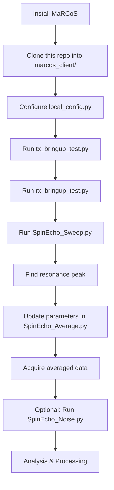

# Low-Field MRI Pulse Sequences for MaRCoS

> Production-ready pulse sequences for low-field MRI using Red Pitaya SDR and the MaRCoS framework

[](https://opensource.org/licenses/MIT)
[](https://www.python.org/downloads/)
[](https://github.com/marcos-mri/marcos_client)

---

## Overview

This repository contains **production-ready pulse sequences** for low-field MRI experiments, built to work with the [MaRCoS](https://github.com/marcos-mri/marcos_client) (Magnetic Resonance Control System) framework. These sequences have been developed from first principles and tested on real hardware.

**Key Features:**
- ✅ **Spin Echo with comprehensive frequency sweep** (ENBW-aware, thermal predictions)
- ✅ **Spin Echo averaging** with phase correction and alignment
- ✅ **Noise floor characterization** tools
- ✅ **FID acquisition** with complex demodulation
- ✅ **Hardware bring-up tests** for TX and RX validation
- ✅ **Rich diagnostic plots** and metrics at every step

---

## Important: These Scripts Require MaRCoS

⚠️ **These pulse sequences are designed to run within the MaRCoS framework.** They are **not standalone** scripts - they depend on the MaRCoS client library and must be run from within the `marcos_client` directory structure.

### Why MaRCoS?

MaRCoS provides:
- Hardware communication with Red Pitaya
- Sequence compilation and timing
- Low-level FPGA control
- RF pulse generation
- Data acquisition pipelines

**Without MaRCoS installed, these scripts will not run.**

---

## Installation & Setup

### Step 1: Install MaRCoS Framework

First, you must install the MaRCoS client library:

```bash
# Clone MaRCoS repository
git clone https://github.com/marcos-mri/marcos_client.git
cd marcos_client

# Install dependencies (follow MaRCoS documentation)
pip install -e .
```

📖 **Full MaRCoS installation guide**: https://github.com/marcos-mri/marcos_client

### Step 2: Clone This Repository into MaRCoS

**IMPORTANT**: Clone this repo **inside** your `marcos_client` directory:

```bash
# From inside marcos_client/
git clone https://github.com/YOUR-USERNAME/low-field-mri-sequences.git
cd low-field-mri-sequences
```

Your directory structure should look like:
```
marcos_client/
├── experiment.py          # MaRCoS core (provides Experiment class)
├── local_config.py        # Your hardware configuration
├── low-field-mri-sequences/    # This repository
│   ├── SpinEcho_Sweep.py
│   ├── SpinEcho_Average.py
│   ├── FID_Acquisition.py
│   └── ...
└── ... (other MaRCoS files)
```

### Step 3: Configure Your Hardware

Edit `marcos_client/local_config.py` to match your setup:

```python
# Example local_config.py
ip_address = "192.168.0.140"  # Your Red Pitaya IP
port = 11111
fpga_clk_freq_MHz = 122.88
grad_board = "gpa-fhdo"
gpa_fhdo_current_per_volt = 2.5
```

If this file doesn't exist, create it using the template from MaRCoS documentation.

### Step 4: Install Additional Dependencies

```bash
pip install numpy matplotlib scipy
```

---

## Quick Start

All scripts are run from the `low-field-mri-sequences/` directory **within** your `marcos_client` installation.

### 1. Test Your Hardware

```bash
cd marcos_client/low-field-mri-sequences

# Test TX output (connect oscilloscope)
python tx_bringup_test.py

# Test RX input (connect signal generator)
python rx_bringup_test.py
```

These tests verify your Red Pitaya connection and RF chain.

### 2. Find Your Resonance Frequency

```bash
python SpinEcho_Sweep.py
```

**What it does:**
- Sweeps through frequency range
- Acquires spin echo at each frequency
- Creates detailed diagnostic plots
- Computes ENBW, thermal noise predictions, SNR
- Outputs results to `sweep_results/` folder

**Edit the script to set your frequency range:**
```python
if __name__ == "__main__":
    sweep_spin_echo(
        freq_start=2.08,      # MHz
        freq_stop=2.13,       # MHz
        freq_step=0.0025,     # 2.5 kHz steps
        lpf_cut_hz=3600.0,    # Post-acquisition LPF
        rx_t_us=0.25,         # Sample period (4 MS/s)
    )
```

### 3. Acquire Averaged Spin Echo

Once you know your resonance frequency:

```bash
python SpinEcho_Average.py
```

**Edit settings at top of file:**
```python
LO_FREQ_MHZ = 2.113      # Your resonance from sweep
N_REPS = 64              # Number of averages
PULSE90_US = 300.0       # 90° pulse duration
PULSE180_US = 600.0      # 180° pulse duration
TAU_US = 600.0           # Echo delay
```

**Outputs:**
- Complex averaged signal
- Coherent vs incoherent averaging comparison
- SNR vs N plot showing averaging improvement
- Amplitude spectral density (ASD)
- Raw data saved as `.npz` for offline analysis

### 4. Characterize Noise Floor

```bash
python SpinEcho_Noise.py
```

**What it does:**
- Runs spin echo sequence with TX **disabled** (pure noise measurement)
- Computes effective noise bandwidth (ENBW)
- Compares measured noise to thermal predictions
- Outputs noise density in nV/√Hz

Useful for:
- Verifying receiver performance
- SNR budget calculations
- Troubleshooting noise issues

### 5. Acquire FID (Free Induction Decay)

```bash
python FID_Acquisition.py
```

**Edit settings:**
```python
def acquire_fid(
    lo_freq_MHz = 2.1075,
    rf_amplitude = 0.011,
    pulse_us = 50.0,
    acq_us = 100,
    # ...
)
```

**Outputs:**
- Complex FID signal
- Residual frequency detection and demodulation
- Envelope after demodulation
- Instantaneous frequency tracking

---

## How These Scripts Work

### Key Concepts

#### 1. The `Experiment` Class (from MaRCoS)

All scripts use:
```python
from experiment import Experiment  # Imported from marcos_client
```

This class handles:
- Hardware connection to Red Pitaya
- Sequence compilation
- TX/RX timing and gating
- Data acquisition

#### 2. Sequence Definition

Sequences are defined as dictionaries with time/amplitude arrays:

```python
seq = {
    "tx0": (tx_times, tx_amplitudes + 0j),  # RF pulse on TX0
    "rx0_en": (rx_times, rx_gate),          # RX gate timing
}
expt.add_flodict(seq)
rxd, msgs = expt.run()
```

#### 3. Data Flow

```
Define sequence → Compile → Upload to FPGA → Execute → Acquire → Process → Plot
```

---

## File Descriptions

### Production Sequences

#### `SpinEcho_Sweep.py` ⭐ **Primary Tool**
Comprehensive frequency sweep with advanced analysis:
- Reuses single `Experiment` object (efficient)
- Per-frequency diagnostic plots
- ENBW calculation for proper noise bandwidth
- Thermal noise predictions (LNA gain, noise figure)
- Echo peak detection and SNR estimation
- Creates `sweep_results/` with summary.txt

**Use this to find your resonance frequency.**

#### `SpinEcho_Average.py`
N-shot averaging with alignment and phase correction:
- Cross-correlation alignment of echo peaks
- Per-shot phase correction relative to reference
- Coherent (complex) vs incoherent (magnitude) averaging
- SNR vs N analysis
- Outputs `.npz` with all shots for offline reprocessing

**Use this for high-SNR spin echo acquisition.**

#### `SpinEcho_Noise.py`
Receiver noise characterization:
- TX disabled (pure noise measurement)
- Computes ENBW of applied filters
- Thermal noise predictions based on:
  - LNA gain (default 38 dB)
  - Noise figure (default 1 dB)
  - Temperature (300 K)
- Compares measured vs predicted noise
- Optional 50 Hz mains notch filter

**Use this to verify receiver performance.**

#### `FID_Acquisition.py`
Free induction decay with complex processing:
- Automatic residual frequency detection
- Complex demodulation to baseband
- Envelope extraction after demodulation
- Instantaneous frequency tracking
- Multiple diagnostic plots

**Use this for T2* measurements or quick signal tests.**

### Hardware Tests

#### `tx_bringup_test.py`
Validates TX chain:
- Generates simple test waveforms
- Step function or modulated sine wave
- Check output on oscilloscope
- Verifies Red Pitaya connection and timing

#### `rx_bringup_test.py`
Validates RX chain:
- Three test modes: simple capture, frequency sweep, detailed analysis
- Requires external signal generator input
- Plots I/Q constellation, spectrum, time-domain
- Verifies ADC and signal path

---

## Typical Workflow



### Step-by-Step

1. **Hardware Setup**
   - Connect Red Pitaya to network
   - Connect RF TX/RX chains
   - Configure `local_config.py`

2. **Bring-Up Tests**
   - TX test → verify RF output
   - RX test → verify signal reception

3. **Find Resonance**
   - Run `SpinEcho_Sweep.py` over expected range
   - Check `sweep_results/sweep_plot.png`
   - Note peak frequency from console output

4. **Optimize Parameters**
   - Tune RF amplitudes (avoid saturation)
   - Adjust pulse widths for 90°/180° tips
   - Set τ delay based on T2

5. **Acquire Data**
   - Run `SpinEcho_Average.py` with N averages
   - Check SNR improvement plot
   - Extract data from `.npz` for analysis

6. **Characterize System**
   - Run `SpinEcho_Noise.py` for noise floor
   - Compare measured vs thermal predictions

---

## Parameter Tuning Guide

### RF Amplitude
- **Start low**: 0.01 - 0.05
- **Increase gradually**: Monitor signal vs amplitude
- **Too high**: Saturation, ringing, distortion
- **Too low**: Poor SNR

### Pulse Width
- **90° pulse**: Typically 10-500 μs depending on B₁
- **180° pulse**: Typically 2× the 90° duration (for same B₁)
- **Calibration**: Vary pulse width, observe signal vs width curve

### τ Delay (Spin Echo)
- **Typical range**: 200-2000 μs
- **Longer τ**: More T₂ decay, lower SNR, better refocusing
- **Shorter τ**: Less decay, higher SNR, less inhomogeneity refocusing

### Acquisition Time
- **FID**: Capture 3-5× T₂* 
- **Spin Echo**: Capture full echo plus baseline
- **Noise**: Long captures (>10 ms) for stable RMS

### Sampling Rate
- **Faster**: Better time resolution, more noise bandwidth
- **Slower**: Less data, narrower noise bandwidth
- **Sweet spot**: 2-4 MS/s for typical low-field applications

---

## Understanding the Outputs

### SpinEcho_Sweep.py Output Structure

```
sweep_results/
├── freq_2.080000MHz/
│   ├── se_2.080000MHz_complex.png       # I/Q time-domain
│   ├── se_2.080000MHz_mag.png           # Echo magnitude
│   ├── se_2.080000MHz_asd.png           # Amplitude spectral density
│   └── ...
├── freq_2.082500MHz/
│   └── ...
├── sweep_plot.png                        # Peak vs frequency
└── summary.txt                           # Metrics for all frequencies
```

**Key metrics in summary.txt:**
- `echo_peak`: Maximum echo voltage
- `snr_peak`: Peak divided by pre-echo noise RMS
- `enbw_hz`: Effective noise bandwidth after LPF
- `ratio_dens`: Measured/predicted noise density

### SpinEcho_Average.py Output

```
averages_out/
├── avg_run1_complex_avg.png              # Averaged I/Q
├── avg_run1_mag_avg.png                  # Coherent vs incoherent
├── avg_run1_mag_avg_zoom.png             # Echo zoom
├── avg_run1_snr_vs_N.png                 # SNR improvement
├── avg_run1_asd.png                      # Spectral density
├── avg_run1_raw.npz                      # Raw data (all shots)
└── avg_run1_summary.json                 # Metrics
```

**Load .npz data in Python:**
```python
import numpy as np
data = np.load('avg_run1_raw.npz')
raw_shots = data['raw']           # (N_reps, N_samples)
aligned = data['aligned_shots']   # After alignment + phase correction
avg_cplx = data['avg_complex']    # Coherent average
meta = data['meta'].item()        # Parameters used
```

---

## Voltage Calibration

The Red Pitaya ADC returns dimensionless units. To convert to volts:

### Method 1: Known Input Signal
1. Apply known voltage to RX input (e.g., -20 dBm = 22.4 mV RMS)
2. Run `rx_bringup_test.py`
3. Measure ADC output magnitude
4. Calculate: `volts_per_unit = known_voltage / adc_reading`

### Method 2: Datasheet Calculation
For Red Pitaya STEMlab 125-14:
- ADC range: ±1 V (with HV jumpers)
- ADC bits: 14-bit
- Units after CIC: scaled by decimation
- Typical: ~0.00845 V/unit (but **calibrate for your system!**)

**Update in each script:**
```python
volts_per_unit = 0.00845  # Your calibrated value
```

---

## Troubleshooting

### No signal detected
1. ✅ Check `local_config.py` IP address
2. ✅ Verify Red Pitaya is powered and connected
3. ✅ Run `tx_bringup_test.py` → check oscilloscope
4. ✅ Run `rx_bringup_test.py` with signal generator
5. ✅ Check RF chain connections (TX → coil → RX)
6. ✅ Verify sample is in coil and at correct field strength

### Poor SNR
1. ✅ Increase number of averages (`N_REPS`)
2. ✅ Enable/tune low-pass filter (`LPF_CUT_HZ`)
3. ✅ Check for 50/60 Hz mains interference
4. ✅ Run `SpinEcho_Noise.py` → compare to thermal baseline
5. ✅ Verify grounding and shielding
6. ✅ Check LNA gain and noise figure settings

### Import errors
```
ModuleNotFoundError: No module named 'experiment'
```
**Solution**: You must run scripts from within `marcos_client/` directory structure. The `experiment` module is part of MaRCoS.

### Timing issues
1. ✅ Check `blank_us` is long enough for TX ring-down
2. ✅ Verify acquisition window captures full signal
3. ✅ Ensure `rx_t` sampling period matches expectations

### Data mismatch
- **Requested acq_us ≠ actual**: Normal - FPGA quantizes timing
- **Fewer samples than expected**: Check FIFO overflow messages
- **Empty RX buffer**: Verify RX gate timing, check `flush_old_rx=True`

---

## Advanced Topics

### Custom Pulse Sequences

To create your own sequence:

```python
from experiment import Experiment

expt = Experiment(
    lo_freq=2.1,        # MHz
    rx_t=0.25,          # μs sample period
    init_gpa=False,     # Set True if using gradients
    auto_leds=True,
    flush_old_rx=True
)

# Define timing
tx_times = np.array([0, 100, 500, 600])  # μs
tx_amps = np.array([0.5, 0, 0.5, 0])     # DAC units

rx_times = np.array([650, 1650])         # μs
rx_gate = np.array([1, 0])               # Enable/disable

seq = {
    "tx0": (tx_times, tx_amps + 0j),
    "rx0_en": (rx_times, rx_gate)
}

expt.add_flodict(seq)
rxd, msgs = expt.run()

data = rxd["rx0"]  # Complex array
```

### Batch Processing

Process multiple `.npz` files:
```python
import numpy as np
import glob

for fname in glob.glob('averages_out/*.npz'):
    data = np.load(fname)
    avg = data['avg_complex']
    # Your analysis here
```

### Exporting Data

```python
# Save to CSV
np.savetxt('echo_data.csv', 
           np.column_stack([t, avg.real, avg.imag]),
           delimiter=',',
           header='time_us,real_V,imag_V')

# Save to MATLAB
from scipy.io import savemat
savemat('echo_data.mat', {'t': t, 'signal': avg})
```

---

## Contributing

Contributions welcome! Please:
1. Fork the repository
2. Create a feature branch (`git checkout -b feature/new-sequence`)
3. Test thoroughly on hardware
4. Update documentation
5. Submit a pull request

**Areas for contribution:**
- Additional pulse sequences (CPMG, inversion recovery, etc.)
- Automated calibration routines
- Advanced post-processing
- Documentation improvements

---

## Citation

If you use this code in your research, please cite:

```
[Your Name], [Institution], 2025
Low-Field MRI Pulse Sequences for MaRCoS Framework
GitHub: https://github.com/YOUR-USERNAME/low-field-mri-sequences
```

**And cite the MaRCoS framework:**
```
MaRCoS: Magnetic Resonance Control System
https://github.com/marcos-mri/marcos_client
```

---

## License

This project is licensed under the MIT License - see [LICENSE](LICENSE) file for details.

---

## Acknowledgments

- Built on the [MaRCoS framework](https://github.com/marcos-mri/marcos_client)
- Inspired by the open-source MRI community
- Developed through hands-on experimentation and learning from first principles

---

## Support

- **Issues**: [GitHub Issues](https://github.com/YOUR-USERNAME/low-field-mri-sequences/issues)
- **MaRCoS Documentation**: https://github.com/marcos-mri/marcos_client
- **Red Pitaya**: https://redpitaya.com/

---

## Learn More

### MaRCoS Resources
- [MaRCoS GitHub](https://github.com/marcos-mri/marcos_client)
- [MaRCoS Documentation](https://github.com/marcos-mri/marcos_client/wiki)

### MRI Fundamentals
- [Open-source MRI](https://openmri.github.io/)
- [MRI Physics Tutorials](https://mrimaster.com/)
- [Spin Echo Principles](https://mriquestions.com/spin-echo.html)

---

**Built from first principles to understand every aspect of MRI acquisition. Happy experimenting! 🧲**
